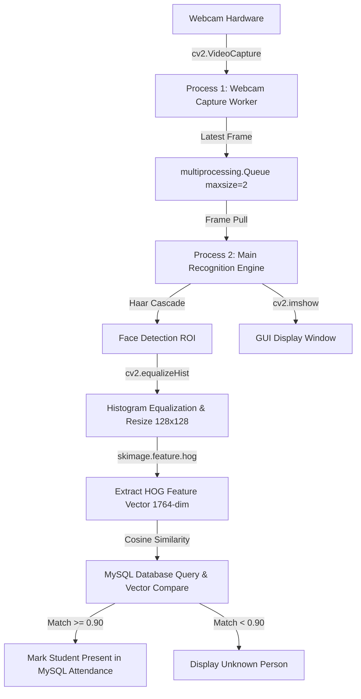

# Real-Time Attendance System with Facial Recognition

A high-performance real-time face recognition attendance system built using **Python, OpenCV, Haar Cascade, HOG (Histogram of Oriented Gradients), MySQL, and Multiprocessing**.

---

## 📌 1. Project Overview

This project recreates a classic computer vision attendance system using classical feature extraction algorithms rather than heavy deep learning models. It features:
- **Student Registration**: Capture 100 face images per student, preprocess them, compute HOG feature vectors, calculate an averaged representative vector, and store it in MySQL.
- **Multiprocessing Pipeline**: Separates continuous webcam frame acquisition from image processing & recognition logic to achieve smooth frame rates.
- **Cosine Similarity Matching**: Compares live face vectors against stored database vectors using cosine similarity with customizable thresholds and ambiguity filtering.
- **Attendance Tracking**: Automatically logs student presence for the current date, recording the exact initial attendance time without duplicates or overwrites.

---

## 🛠️ 2. Technologies Used

- **Python 3.10+**: Core programming language.
- **OpenCV (`opencv-python`)**: Video capture, Haar Cascade face detection, image preprocessing (histogram equalization, resizing), and GUI rendering.
- **Scikit-image (`skimage.feature.hog`)**: HOG (Histogram of Oriented Gradients) feature descriptor extraction.
- **NumPy**: Linear algebra, matrix operations, vector normalization, and similarity math.
- **MySQL (`mysql-connector-python`)**: Relational database storage for student details, feature vectors (JSON format), and attendance records.
- **Python Multiprocessing (`multiprocessing`)**: Multi-core process separation (Frame Capture process + Recognition/Main process).
- **Python-Dotenv**: Secure environment variable management via `.env`.

---

## 🏗️ 3. Project Architecture

```
e:\smart attendance project\
│
├── main.py                          # CLI Terminal Menu & Multiprocessing Orchestrator
├── database.py                      # MySQL Connection & CRUD Operations
├── face_utils.py                    # OpenCV Face Detection & HOG Feature Extraction
├── config.py                        # Configuration Settings & Environment Loader
├── schema.sql                       # MySQL Database & Table Creation Script
├── requirements.txt                 # Python Dependencies
├── haarcascade_frontalface_default.xml # Pre-trained Haar Cascade Face Detector
├── test_system.py                   # Automated Test Suite
├── .env.example                     # Environment Variables Template
├── .env                             # Active Local Configuration
├── .gitignore                       # Git Ignored Files
└── README.md                        # Documentation
```

### Multiprocessing Dataflow



---

## 🚀 4. Installation & Setup Instructions

### Step 1: Clone or Open Workspace
Ensure all project files are located in your working directory (`e:\smart attendance project`).

### Step 2: Install Python Dependencies
Open your terminal/command prompt and run:
```bash
pip install -r requirements.txt
```

### Step 3: Configure Environment Variables
Copy `.env.example` to `.env` (if not present) and edit database credentials:
```ini
DB_HOST=localhost
DB_PORT=3306
DB_USER=root
DB_PASSWORD=your_mysql_password
DB_NAME=face_attendance

SIMILARITY_THRESHOLD=0.90
MIN_MATCH_DIFF=0.03
MAX_STUDENTS=3
WEBCAM_INDEX=0
```

---

## 🗄️ 5. MySQL Database Setup

1. **Start MySQL Server**: Ensure your MySQL server (e.g., MySQL Server, XAMPP MySQL, WAMP, or Docker MySQL) is running.
2. **Execute Schema** (Optional - the application also creates tables automatically on launch):
   ```sql
   mysql -u root -p < schema.sql
   ```
3. **Database Tables**:
   - `students`: Stores `student_id`, `name`, `face_vector` (LONGTEXT JSON array), `created_at`.
   - `attendance`: Stores `attendance_id`, `student_id`, `status` ('Present'/'Absent'), `attendance_date`, `attendance_time` with a `UNIQUE(student_id, attendance_date)` constraint.

---

## 💻 6. How to Run & Use the System

Run the main application:
```bash
python main.py
```

### Terminal Menu Options

```
==============================================
  REAL-TIME FACE ATTENDANCE SYSTEM (HOG + MySQL)
==============================================
1. Register Student (Max 3)
2. Start Attendance (Multiprocessing & Recognition)
3. View Attendance Records
4. Exit
----------------------------------------------
```

### Option 1: Register Student
1. Select option `1`.
2. Input Student ID (e.g. `STU001`) and Name (e.g. `John Doe`).
3. System opens webcam and captures 100 face images automatically.
4. Each face is preprocessed (Equalized + Resized to 128x128) and HOG features are extracted.
5. All 100 vectors are averaged into a single normalized representative vector and stored in MySQL.
6. **Constraint**: Maximum 3 students can be registered initially. Duplicate Student IDs are rejected.

### Option 2: Start Attendance
1. Select option `2`.
2. The system checks database for registered students and initializes today's attendance table (marking all registered students as `Absent`).
3. Multiprocessing starts: Process 1 captures frames from webcam, Process 2 performs real-time detection, feature extraction, and cosine similarity matching.
4. If similarity $\ge 0.90$, bounding box turns **GREEN**, student's name is displayed, and MySQL updates their status to `Present` with timestamp.
5. If match is below threshold or ambiguous, box turns **RED** with label `Unknown Person` (no attendance recorded).
6. Press `'q'` inside the video window to stop attendance.

### Option 3: View Attendance Records
Select option `3` to display a clean table containing:
`Student ID`, `Student Name`, `Status`, `Date`, and `Initial Recognition Time`.

---

## 🧠 7. Conceptual Deep Dive

### A. How Haar Cascade Works
Haar Cascade is a machine-learning based object detection algorithm proposed by Paul Viola and Michael Jones.
- **Haar Features**: Uses rectangular kernels (edge features, line features, center-surround features) to compute pixel intensity differences using an **Integral Image**.
- **Cascade Classifiers**: Rejects non-face regions quickly in early stages of a cascade tree, passing only candidate regions to subsequent complex classifiers.

### B. How HOG (Histogram of Oriented Gradients) Works
HOG captures local shape and appearance by evaluating gradient magnitude and orientation.
1. **Grayscale & Histogram Equalization**: Normalizes illumination differences.
2. **Resize**: Resizes face ROI to a fixed $128 \times 128$ bounding box.
3. **Gradient Computation**: Calculates horizontal ($g_x$) and vertical ($g_y$) pixel intensity changes.
4. **Orientation Binning**: Bins pixel gradient directions into 9 orientation channels ($0^\circ - 180^\circ$).
5. **Block Normalization**: Normalizes cell groups over overlapping $2 \times 2$ blocks ($16 \times 16$ pixels per cell) using L2-Hys norm to achieve illumination invariance.
6. **Feature Vector**: Yields a 1764-dimensional feature representation per face.

### C. How Cosine Similarity Works
Cosine similarity measures the cosine of the angle between two multi-dimensional feature vectors in inner product space:

$$\text{Cosine Similarity} = \frac{\mathbf{A} \cdot \mathbf{B}}{\|\mathbf{A}\| \|\mathbf{B}\|} = \frac{\sum_{i=1}^n A_i B_i}{\sqrt{\sum_{i=1}^n A_i^2} \sqrt{\sum_{i=1}^n B_i^2}}$$

- **1.0**: Exact match (0-degree angle).
- **0.0**: Completely orthogonal (no correlation).
- **Threshold Calibration**: Default threshold is set to `0.90` with a minimum difference requirement (`0.03`) between best and second-best match to eliminate false positives.

### D. How Multiprocessing Prevents Frame Lag
Standard single-threaded webcam capture can lag when image processing tasks (such as HOG calculation and database lookup) take longer than frame interval time ($33\text{ ms}$).
- **Process 1 (Producer)**: Dedicated process continuously reading hardware video frames into a `multiprocessing.Queue(maxsize=2)`.
- **Process 2 (Consumer)**: Main process pops latest frame from queue. If queue is full, oldest frames are dropped immediately so recognition always processes real-time frames without buffering delay.

---

## 🧪 8. Testing

Run the included test suite to verify code logic:
```bash
python test_system.py
```

Expected output:
```
Ran 6 tests in 0.283s
OK
[TEST PASS] HOG feature vector length: 1764
```

---

## ❓ 9. Troubleshooting & Common Errors

1. **MySQL Connection Error (`Can't connect to MySQL server`)**:
   - Ensure MySQL service is running (`net start MySQL` or XAMPP Control Panel).
   - Check `.env` for correct host, port, username, and password.
2. **Webcam Error (`Cannot access webcam index 0`)**:
   - Verify camera permissions in Windows settings.
   - If using external USB webcam, change `WEBCAM_INDEX=1` in `.env`.
3. **Low Recognition Accuracy / False Unknowns**:
   - Ensure adequate lighting during both registration and attendance.
   - Adjust `SIMILARITY_THRESHOLD` in `.env` (e.g. try `0.85` or `0.88` depending on ambient lighting).

